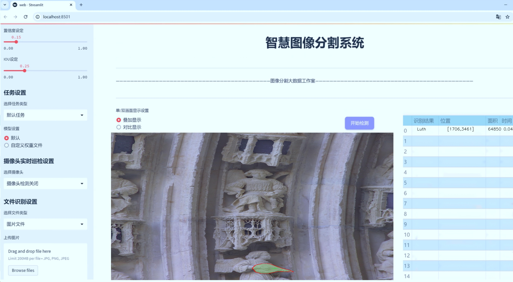
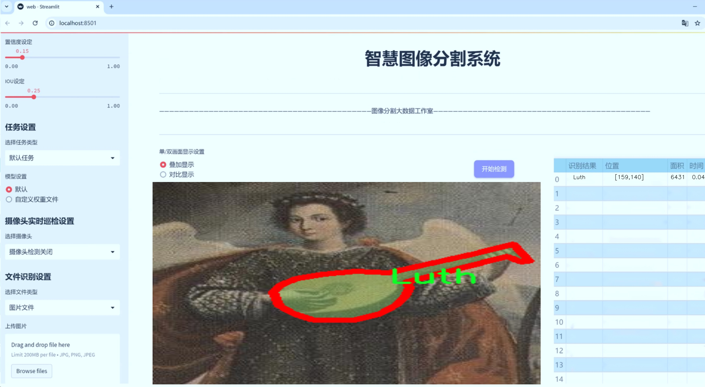
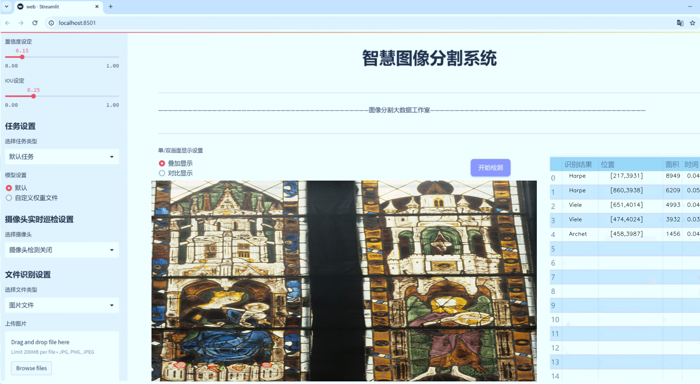
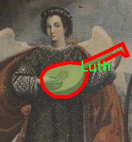
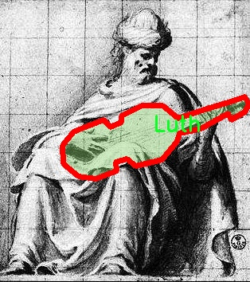
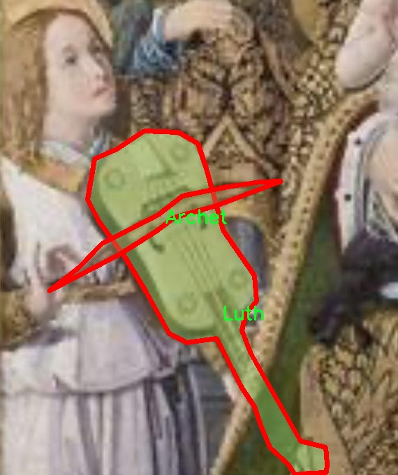
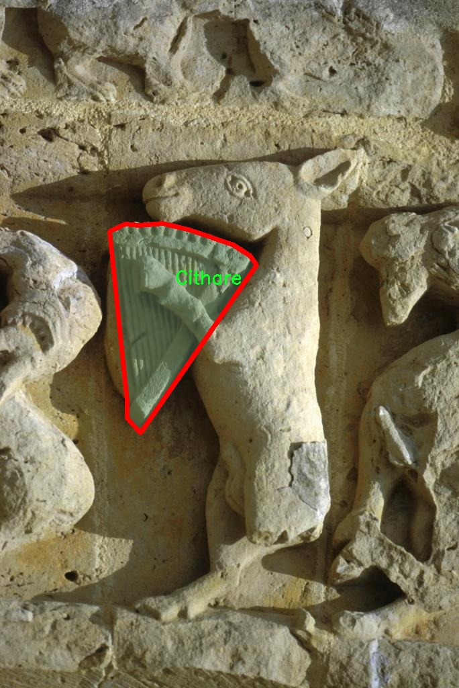
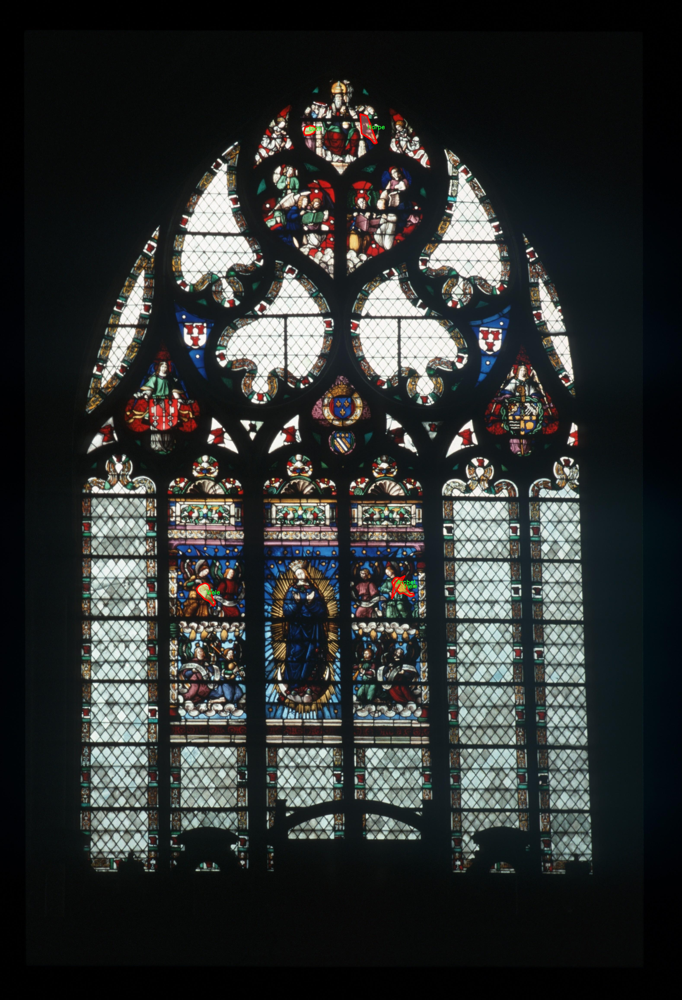

# 考古场景乐器图像分割系统： yolov8-seg-AIFI

### 1.研究背景与意义

[参考博客](https://gitee.com/YOLOv8_YOLOv11_Segmentation_Studio/projects)

[博客来源](https://kdocs.cn/l/cszuIiCKVNis)

研究背景与意义

在考古学的研究中，乐器作为文化遗产的重要组成部分，不仅承载着历史的记忆，还反映了特定时期的社会、经济和艺术发展。随着考古学的不断发展，如何高效、准确地识别和分析考古现场出土的乐器图像，成为了研究者面临的一项重要挑战。传统的乐器识别方法往往依赖于人工标注和专家知识，效率低下且容易受到主观因素的影响。因此，基于计算机视觉的自动化图像分割技术逐渐受到关注，尤其是深度学习技术的迅猛发展，为乐器图像的自动识别和分类提供了新的可能性。

YOLO（You Only Look Once）系列模型因其在目标检测领域的高效性和准确性，逐渐成为研究者的首选工具。YOLOv8作为该系列的最新版本，结合了多种先进的深度学习技术，具有更强的特征提取能力和更快的推理速度。然而，尽管YOLOv8在一般场景下表现出色，但在特定的考古场景中，由于乐器图像的多样性和复杂性，仍然存在识别精度不足的问题。因此，改进YOLOv8以适应考古乐器图像的特征，构建一个高效的图像分割系统，具有重要的学术价值和实际意义。

本研究将利用Musiconis数据集，该数据集包含1200幅乐器图像，涵盖14个不同的乐器类别，包括弓弦乐器、键盘乐器和打击乐器等。这些乐器不仅在形态上各具特色，而且在历史背景和文化内涵上也具有重要的研究价值。通过对这些图像进行深度学习训练，我们能够提取出乐器的独特特征，进而实现对考古现场乐器的自动分割和识别。这一过程不仅可以提高考古学研究的效率，还能为乐器的保护和修复提供科学依据。

此外，基于改进YOLOv8的考古场景乐器图像分割系统，能够为考古学、音乐学和计算机视觉等多个学科的交叉研究提供新的视角和方法。通过对乐器图像的深入分析，我们可以揭示乐器在不同历史时期的演变过程，探讨其在社会文化中的角色，进而丰富我们对人类文化遗产的理解。同时，该系统的构建也为未来其他类型的考古图像分析提供了借鉴，推动了相关领域的技术进步。

综上所述，基于改进YOLOv8的考古场景乐器图像分割系统的研究，不仅具有重要的理论意义，还具备广泛的应用前景。通过提升乐器图像的识别精度和处理效率，我们能够更好地保护和传承人类的文化遗产，为考古学的未来发展开辟新的道路。

### 2.图片演示







注意：本项目提供完整的训练源码数据集和训练教程,由于此博客编辑较早,暂不提供权重文件（best.pt）,需要按照6.训练教程进行训练后实现上图效果。

### 3.视频演示

[3.1 视频演示](https://www.bilibili.com/video/BV178UNYBE6X/)

### 4.数据集信息

##### 4.1 数据集类别数＆类别名

nc: 14
names: ['Archet', 'Autel', 'Cithare', 'Feuillet', 'Harpe', 'Livre', 'Luth', 'Lutrin', 'Lyre', 'Personne Debout', 'Personne debouts - seminaire frederic', 'Philactere', 'TexteChante', 'Viele']


##### 4.2 数据集信息简介

数据集信息展示

在本研究中，我们使用了名为“Musiconis”的数据集，以训练和改进YOLOv8-seg模型，旨在实现对考古场景中乐器图像的高效分割。该数据集包含14个类别，涵盖了多种乐器及相关元素，具体类别包括：Archet（弓）、Autel（祭坛）、Cithare（古琴）、Feuillet（乐谱）、Harpe（竖琴）、Livre（书籍）、Luth（鲁特琴）、Lutrin（书架）、Lyre（竖琴）、Personne Debout（站立的人）、Personne debouts - seminaire frederic（站立的人 - 弗雷德里克研讨会）、Philactere（对话框）、TexteChante（歌唱文本）以及Viele（小提琴）。这些类别不仅代表了考古学中的乐器，还涵盖了与音乐相关的文化和历史元素，提供了丰富的上下文信息，有助于模型在复杂场景中进行准确的图像分割。

“Musiconis”数据集的构建旨在为考古学研究提供一个高质量的视觉数据源，特别是在乐器的识别和分类方面。每个类别都经过精心标注，确保了数据的准确性和一致性。数据集中包含的乐器种类反映了历史上不同文化对音乐的理解和表达方式，展示了乐器在社会生活中的重要性。通过对这些乐器的图像进行分割，研究人员可以更好地分析它们在考古遗址中的分布情况，从而揭示出古代人类的音乐活动及其社会文化背景。

在训练YOLOv8-seg模型时，我们将“Musiconis”数据集的多样性和复杂性作为关键因素，力求提升模型在实际应用中的表现。数据集中包含的乐器图像不仅有助于模型学习不同乐器的形状和特征，还能够帮助模型理解乐器在不同场景中的相对位置和上下文关系。例如，站立的人物类别与乐器的组合可以为模型提供关于音乐表演或社交活动的线索，从而提高分割的准确性和鲁棒性。

此外，数据集的多样性也为模型的泛化能力提供了支持。通过在多种乐器和相关元素的图像上进行训练，YOLOv8-seg模型能够更好地适应不同的考古场景和拍摄条件。这种适应性不仅有助于提高模型在实际应用中的性能，还能够推动考古学领域的研究进展，使得对古代音乐文化的理解更加深入。

总之，“Musiconis”数据集为本研究提供了一个坚实的基础，支持我们在考古场景中实现乐器图像的高效分割。通过对该数据集的深入分析和应用，我们希望能够推动乐器识别技术的发展，并为考古学研究提供新的视角和方法。











### 5.项目依赖环境部署教程（零基础手把手教学）

[5.1 环境部署教程链接（零基础手把手教学）](https://www.bilibili.com/video/BV1jG4Ve4E9t/?vd_source=bc9aec86d164b67a7004b996143742dc)


[5.2 安装Python虚拟环境创建和依赖库安装视频教程链接（零基础手把手教学）](https://www.bilibili.com/video/BV1nA4VeYEze/?vd_source=bc9aec86d164b67a7004b996143742dc)

### 6.手把手YOLOV8-seg训练视频教程（零基础手把手教学）

[6.1 手把手YOLOV8-seg训练视频教程（零基础小白有手就能学会）](https://www.bilibili.com/video/BV1cA4VeYETe/?vd_source=bc9aec86d164b67a7004b996143742dc)


按照上面的训练视频教程链接加载项目提供的数据集，运行train.py即可开始训练



     Epoch   gpu_mem       box       obj       cls    labels  img_size
     1/200     0G   0.01576   0.01955  0.007536        22      1280: 100%|██████████| 849/849 [14:42<00:00,  1.04s/it]
               Class     Images     Labels          P          R     mAP@.5 mAP@.5:.95: 100%|██████████| 213/213 [01:14<00:00,  2.87it/s]
                 all       3395      17314      0.994      0.957      0.0957      0.0843

     Epoch   gpu_mem       box       obj       cls    labels  img_size
     2/200     0G   0.01578   0.01923  0.007006        22      1280: 100%|██████████| 849/849 [14:44<00:00,  1.04s/it]
               Class     Images     Labels          P          R     mAP@.5 mAP@.5:.95: 100%|██████████| 213/213 [01:12<00:00,  2.95it/s]
                 all       3395      17314      0.996      0.956      0.0957      0.0845

     Epoch   gpu_mem       box       obj       cls    labels  img_size
     3/200     0G   0.01561    0.0191  0.006895        27      1280: 100%|██████████| 849/849 [10:56<00:00,  1.29it/s]
               Class     Images     Labels          P          R     mAP@.5 mAP@.5:.95: 100%|███████   | 187/213 [00:52<00:00,  4.04it/s]
                 all       3395      17314      0.996      0.957      0.0957      0.0845


### 7.50+种全套YOLOV8-seg创新点加载调参实验视频教程（一键加载写好的改进模型的配置文件）

[7.1 50+种全套YOLOV8-seg创新点加载调参实验视频教程（一键加载写好的改进模型的配置文件）](https://www.bilibili.com/video/BV1Hw4VePEXv/?vd_source=bc9aec86d164b67a7004b996143742dc)

### YOLOV8-seg算法简介

原始YOLOv8-seg算法原理

YOLOv8-seg算法是YOLO系列中的最新进展，专注于目标检测与分割任务的结合。该算法在YOLOv8的基础上进行了进一步的扩展，旨在同时实现高效的目标检测和精确的实例分割。YOLOv8-seg的设计理念是将目标检测与语义分割相结合，使得模型不仅能够识别图像中的目标，还能对目标的形状进行精确的分割。这一特性使得YOLOv8-seg在许多应用场景中具有显著的优势，尤其是在需要精细化目标识别的任务中，如自动驾驶、医学影像分析等。

在YOLOv8-seg中，整个网络结构依然保持了YOLO系列一贯的高效设计，主要由输入层、主干网络、颈部网络和头部网络组成。输入层负责对输入图像进行预处理，包括缩放和归一化，以满足模型的输入要求。主干网络采用了卷积神经网络（CNN）结构，通过一系列卷积层对输入图像进行特征提取。与YOLOv8相比，YOLOv8-seg在主干网络中引入了更多的特征提取模块，尤其是C2f模块，这一模块通过跨层连接的方式增强了特征的表达能力，提升了模型对复杂场景的适应性。

主干网络的最后部分使用了SPPFl（Spatial Pyramid Pooling with Feature Learning）模块，通过多尺度的池化操作，进一步增强了特征的抽象能力。这一设计使得YOLOv8-seg能够更好地处理不同尺度的目标，从而提高了检测和分割的精度。颈部网络则利用了特征金字塔网络（FPN）和路径聚合网络（PAN）结构，融合了来自不同层次的特征图信息，确保了丰富的上下文信息能够被有效利用。这样的特征融合策略对于分割任务尤为重要，因为分割不仅需要准确的边界定位，还需要对目标的上下文信息进行充分理解。

在头部网络中，YOLOv8-seg采用了解耦合的检测头结构，将目标检测和实例分割任务分开处理。具体而言，检测头负责预测目标的位置和类别，而分割头则专注于生成目标的分割掩码。这种解耦的设计使得模型能够更专注于各自的任务，从而提高了整体的检测和分割性能。此外，YOLOv8-seg还采用了Anchor-free的目标检测方法，避免了传统方法中锚框选择的复杂性，使得模型在处理不同形状和尺度的目标时更加灵活。

在训练过程中，YOLOv8-seg使用了一系列先进的数据增强技术，以提高模型的泛化能力。特别是在最后的训练阶段，动态的样本分配策略被引入，以确保模型能够有效地学习到不同类别和尺度的目标特征。损失函数方面，YOLOv8-seg结合了BCELoss、DFLLoss和CIoULoss等多种损失函数，确保了分类和回归任务的优化能够同步进行，从而提升了模型的整体性能。

YOLOv8-seg的创新之处不仅体现在网络结构的设计上，还在于其在实际应用中的表现。通过对目标的精确分割，YOLOv8-seg能够在复杂场景中实现更高的准确率和更快的处理速度，满足实时检测的需求。无论是在智能监控、自动驾驶还是医学影像分析等领域，YOLOv8-seg都展现出了强大的应用潜力。

综上所述，YOLOv8-seg算法通过对YOLOv8的深度优化与扩展，成功地将目标检测与实例分割相结合，形成了一种高效、准确的解决方案。其创新的网络结构、灵活的特征融合策略以及高效的训练方法，使得YOLOv8-seg在各种复杂场景中都能表现出色，成为目标检测与分割领域的重要工具。随着深度学习技术的不断发展，YOLOv8-seg有望在更多应用场景中发挥其独特的优势，推动智能视觉技术的进一步进步。


### 9.系统功能展示（检测对象为举例，实际内容以本项目数据集为准）

图9.1.系统支持检测结果表格显示

  图9.2.系统支持置信度和IOU阈值手动调节

  图9.3.系统支持自定义加载权重文件best.pt(需要你通过步骤5中训练获得)

  图9.4.系统支持摄像头实时识别

  图9.5.系统支持图片识别

  图9.6.系统支持视频识别

  图9.7.系统支持识别结果文件自动保存

  图9.8.系统支持Excel导出检测结果数据


### 10.50+种全套YOLOV8-seg创新点原理讲解（非科班也可以轻松写刊发刊，V11版本正在科研待更新）

#### 10.1 由于篇幅限制，每个创新点的具体原理讲解就不一一展开，具体见下列网址中的创新点对应子项目的技术原理博客网址【Blog】：


[10.1 50+种全套YOLOV8-seg创新点原理讲解链接](https://gitee.com/qunmasj/good)

#### 10.2 部分改进模块原理讲解(完整的改进原理见上图和技术博客链接)【如果此小节的图加载失败可以通过CSDN或者Github搜索该博客的标题访问原始博客，原始博客图片显示正常】

### YOLOv8简介
#### Backbone
Darknet-53
53指的是“52层卷积”+output layer。

借鉴了其他算法的这些设计思想

借鉴了VGG的思想，使用了较多的3×3卷积，在每一次池化操作后，将通道数翻倍；

借鉴了network in network的思想，使用全局平均池化（global average pooling）做预测，并把1×1的卷积核置于3×3的卷积核之间，用来压缩特征；（我没找到这一步体现在哪里）


使用了批归一化层稳定模型训练，加速收敛，并且起到正则化作用。

    以上三点为Darknet19借鉴其他模型的点。Darknet53当然是在继承了Darknet19的这些优点的基础上再新增了下面这些优点的。因此列在了这里

借鉴了ResNet的思想，在网络中大量使用了残差连接，因此网络结构可以设计的很深，并且缓解了训练中梯度消失的问题，使得模型更容易收敛。

使用步长为2的卷积层代替池化层实现降采样。（这一点在经典的Darknet-53上是很明显的，output的长和宽从256降到128，再降低到64，一路降低到8，应该是通过步长为2的卷积层实现的；在YOLOv8的卷积层中也有体现，比如图中我标出的这些位置）

#### 特征融合

模型架构图如下

  Darknet-53的特点可以这样概括：（Conv卷积模块+Residual Block残差块）串行叠加4次

  Conv卷积层+Residual Block残差网络就被称为一个stage


上面红色指出的那个，原始的Darknet-53里面有一层 卷积，在YOLOv8里面，把一层卷积移除了

为什么移除呢？

        原始Darknet-53模型中间加的这个卷积层做了什么？滤波器（卷积核）的个数从 上一个卷积层的512个，先增加到1024个卷积核，然后下一层卷积的卷积核的个数又降低到512个

        移除掉这一层以后，少了1024个卷积核，就可以少做1024次卷积运算，同时也少了1024个3×3的卷积核的参数，也就是少了9×1024个参数需要拟合。这样可以大大减少了模型的参数，（相当于做了轻量化吧）

        移除掉这个卷积层，可能是因为作者发现移除掉这个卷积层以后，模型的score有所提升，所以才移除掉的。为什么移除掉以后，分数有所提高呢？可能是因为多了这些参数就容易，参数过多导致模型在训练集删过拟合，但是在测试集上表现很差，最终模型的分数比较低。你移除掉这个卷积层以后，参数减少了，过拟合现象不那么严重了，泛化能力增强了。当然这个是，拿着你做实验的结论，反过来再找补，再去强行解释这种现象的合理性。


通过MMdetection官方绘制册这个图我们可以看到，进来的这张图片经过一个“Feature Pyramid Network(简称FPN)”，然后最后的P3、P4、P5传递给下一层的Neck和Head去做识别任务。 PAN（Path Aggregation Network）


“FPN是自顶向下，将高层的强语义特征传递下来。PAN就是在FPN的后面添加一个自底向上的金字塔，对FPN补充，将低层的强定位特征传递上去，

FPN是自顶（小尺寸，卷积次数多得到的结果，语义信息丰富）向下（大尺寸，卷积次数少得到的结果），将高层的强语义特征传递下来，对整个金字塔进行增强，不过只增强了语义信息，对定位信息没有传递。PAN就是针对这一点，在FPN的后面添加一个自底（卷积次数少，大尺寸）向上（卷积次数多，小尺寸，语义信息丰富）的金字塔，对FPN补充，将低层的强定位特征传递上去，又被称之为“双塔战术”。

FPN层自顶向下传达强语义特征，而特征金字塔则自底向上传达强定位特征，两两联手，从不同的主干层对不同的检测层进行参数聚合,这样的操作确实很皮。
#### 自底向上增强


而 PAN（Path Aggregation Network）是对 FPN 的一种改进，它的设计理念是在 FPN 后面添加一个自底向上的金字塔。PAN 引入了路径聚合的方式，通过将浅层特征图（低分辨率但语义信息较弱）和深层特征图（高分辨率但语义信息丰富）进行聚合，并沿着特定的路径传递特征信息，将低层的强定位特征传递上去。这样的操作能够进一步增强多尺度特征的表达能力，使得 PAN 在目标检测任务中表现更加优秀。


### Gold-YOLO简介
YOLO系列模型面世至今已有8年，由于其优异的性能，已成为目标检测领域的标杆。在系列模型经过十多个不同版本的改进发展逐渐稳定完善的今天，研究人员更多关注于单个计算模块内结构的精细调整，或是head部分和训练方法上的改进。但这并不意味着现有模式已是最优解。

当前YOLO系列模型通常采用类FPN方法进行信息融合，而这一结构在融合跨层信息时存在信息损失的问题。针对这一问题，我们提出了全新的信息聚集-分发（Gather-and-Distribute Mechanism）GD机制，通过在全局视野上对不同层级的特征进行统一的聚集融合并分发注入到不同层级中，构建更加充分高效的信息交互融合机制，并基于GD机制构建了Gold-YOLO。在COCO数据集中，我们的Gold-YOLO超越了现有的YOLO系列，实现了精度-速度曲线上的SOTA。


精度和速度曲线（TensorRT7）


精度和速度曲线（TensorRT8）
传统YOLO的问题
在检测模型中，通常先经过backbone提取得到一系列不同层级的特征，FPN利用了backbone的这一特点，构建了相应的融合结构：不层级的特征包含着不同大小物体的位置信息，虽然这些特征包含的信息不同，但这些特征在相互融合后能够互相弥补彼此缺失的信息，增强每一层级信息的丰富程度，提升网络性能。

原始的FPN结构由于其层层递进的信息融合模式，使得相邻层的信息能够充分融合，但也导致了跨层信息融合存在问题：当跨层的信息进行交互融合时，由于没有直连的交互通路，只能依靠中间层充当“中介”进行融合，导致了一定的信息损失。之前的许多工作中都关注到了这一问题，而解决方案通常是通过添加shortcut增加更多的路径，以增强信息流动。

然而传统的FPN结构即便改进后，由于网络中路径过多，且交互方式不直接，基于FPN思想的信息融合结构仍然存在跨层信息交互困难和信息损失的问题。

#### Gold-YOLO：全新的信息融合交互机制


#### Gold-YOLO架构
参考该博客提出的一种全新的信息交互融合机制：信息聚集-分发机制(Gather-and-Distribute Mechanism)。该机制通过在全局上融合不同层次的特征得到全局信息，并将全局信息注入到不同层级的特征中，实现了高效的信息交互和融合。在不显著增加延迟的情况下GD机制显著增强了Neck部分的信息融合能力，提高了模型对不同大小物体的检测能力。

GD机制通过三个模块实现：信息对齐模块(FAM)、信息融合模块(IFM)和信息注入模块(Inject)。

信息对齐模块负责收集并对齐不同层级不同大小的特征

信息融合模块通过使用卷积或Transformer算子对对齐后的的特征进行融合，得到全局信息

信息注入模块将全局信息注入到不同层级中

在Gold-YOLO中，针对模型需要检测不同大小的物体的需要，并权衡精度和速度，我们构建了两个GD分支对信息进行融合：低层级信息聚集-分发分支(Low-GD)和高层级信息聚集-分发分支(High-GD)，分别基于卷积和transformer提取和融合特征信息。

此外,为了促进局部信息的流动，我们借鉴现有工作，构建了一个轻量级的邻接层融合模块，该模块在局部尺度上结合了邻近层的特征，进一步提升了模型性能。我们还引入并验证了预训练方法对YOLO模型的有效性，通过在ImageNet 1K上使用MAE方法对主干进行预训练，显著提高了模型的收敛速度和精度。


### 11.项目核心源码讲解（再也不用担心看不懂代码逻辑）

#### 11.1 ultralytics\models\fastsam\predict.py

以下是对代码的核心部分进行分析和详细注释的结果：

```python
# 引入必要的库
import torch
from ultralytics.engine.results import Results
from ultralytics.models.fastsam.utils import bbox_iou
from ultralytics.models.yolo.detect.predict import DetectionPredictor
from ultralytics.utils import DEFAULT_CFG, ops

class FastSAMPredictor(DetectionPredictor):
    """
    FastSAMPredictor 类专门用于在 Ultralytics YOLO 框架中进行快速 SAM（Segment Anything Model）分割预测任务。
    该类扩展了 DetectionPredictor，定制了预测管道，特别针对快速 SAM 进行了调整。
    它调整了后处理步骤，以结合掩码预测和非最大抑制，同时优化单类分割。
    """

    def __init__(self, cfg=DEFAULT_CFG, overrides=None, _callbacks=None):
        """
        初始化 FastSAMPredictor 类，继承自 DetectionPredictor，并将任务设置为 'segment'。

        参数:
            cfg (dict): 预测的配置参数。
            overrides (dict, optional): 可选的参数覆盖，用于自定义行为。
            _callbacks (dict, optional): 可选的回调函数列表，在预测过程中调用。
        """
        super().__init__(cfg, overrides, _callbacks)  # 调用父类构造函数
        self.args.task = 'segment'  # 设置任务为分割

    def postprocess(self, preds, img, orig_imgs):
        """
        对预测结果进行后处理，包括非最大抑制和将框缩放到原始图像大小，并返回最终结果。

        参数:
            preds (list): 模型的原始输出预测。
            img (torch.Tensor): 处理后的图像张量。
            orig_imgs (list | torch.Tensor): 原始图像或图像列表。

        返回:
            (list): 包含处理后的框、掩码和其他元数据的 Results 对象列表。
        """
        # 执行非最大抑制，过滤掉低置信度的预测
        p = ops.non_max_suppression(
            preds[0],
            self.args.conf,
            self.args.iou,
            agnostic=self.args.agnostic_nms,
            max_det=self.args.max_det,
            nc=1,  # 设置为 1 类，因为 SAM 没有类预测
            classes=self.args.classes)

        # 创建一个全框，用于存储边界框信息
        full_box = torch.zeros(p[0].shape[1], device=p[0].device)
        full_box[2], full_box[3], full_box[4], full_box[6:] = img.shape[3], img.shape[2], 1.0, 1.0
        full_box = full_box.view(1, -1)  # 将全框调整为合适的形状

        # 计算 IOU，并根据阈值更新 full_box
        critical_iou_index = bbox_iou(full_box[0][:4], p[0][:, :4], iou_thres=0.9, image_shape=img.shape[2:])
        if critical_iou_index.numel() != 0:
            full_box[0][4] = p[0][critical_iou_index][:, 4]  # 更新置信度
            full_box[0][6:] = p[0][critical_iou_index][:, 6:]  # 更新其他信息
            p[0][critical_iou_index] = full_box  # 将更新后的 full_box 赋值给预测结果

        # 确保原始图像是 numpy 格式
        if not isinstance(orig_imgs, list):
            orig_imgs = ops.convert_torch2numpy_batch(orig_imgs)

        results = []  # 初始化结果列表
        proto = preds[1][-1] if len(preds[1]) == 3 else preds[1]  # 获取掩码原型

        # 遍历每个预测结果
        for i, pred in enumerate(p):
            orig_img = orig_imgs[i]  # 获取原始图像
            img_path = self.batch[0][i]  # 获取图像路径

            if not len(pred):  # 如果没有预测框
                masks = None  # 掩码为 None
            elif self.args.retina_masks:  # 如果使用 Retina 掩码
                pred[:, :4] = ops.scale_boxes(img.shape[2:], pred[:, :4], orig_img.shape)  # 缩放框
                masks = ops.process_mask_native(proto[i], pred[:, 6:], pred[:, :4], orig_img.shape[:2])  # 处理掩码
            else:  # 否则使用常规掩码处理
                masks = ops.process_mask(proto[i], pred[:, 6:], pred[:, :4], img.shape[2:], upsample=True)  # 处理掩码
                pred[:, :4] = ops.scale_boxes(img.shape[2:], pred[:, :4], orig_img.shape)  # 缩放框

            # 将结果添加到结果列表中
            results.append(Results(orig_img, path=img_path, names=self.model.names, boxes=pred[:, :6], masks=masks))

        return results  # 返回处理后的结果列表
```

### 代码核心部分分析：
1. **类定义**：`FastSAMPredictor` 继承自 `DetectionPredictor`，专门用于快速分割任务。
2. **初始化方法**：设置任务为分割，并调用父类的初始化方法。
3. **后处理方法**：`postprocess` 方法是该类的核心，负责对模型的原始预测结果进行后处理，包括非最大抑制、框的缩放和掩码的处理。
4. **IOU计算**：使用 `bbox_iou` 函数计算 IOU，以便根据阈值更新预测框的置信度和其他信息。
5. **结果生成**：将处理后的结果封装成 `Results` 对象并返回。

以上是对代码的核心部分和详细注释，希望对理解该代码的功能和结构有所帮助。

该文件定义了一个名为 `FastSAMPredictor` 的类，主要用于在 Ultralytics YOLO 框架中进行快速的 SAM（Segment Anything Model）分割预测任务。这个类继承自 `DetectionPredictor`，并针对快速 SAM 进行了定制化的预测流程。

在类的初始化方法中，首先调用了父类的构造函数，并将任务类型设置为“分割”。这意味着该预测器专注于图像分割任务，而不是一般的目标检测。

`postprocess` 方法是该类的核心功能之一，负责对模型的原始输出进行后处理。这包括非极大值抑制（Non-Max Suppression）和将预测框缩放到原始图像的大小。该方法接受三个参数：`preds` 是模型的原始输出，`img` 是处理后的图像张量，`orig_imgs` 是原始图像或图像列表。

在后处理过程中，首先通过调用 `ops.non_max_suppression` 方法对预测结果进行非极大值抑制，去除冗余的框。接着，创建一个全框（`full_box`），并根据输入图像的尺寸进行初始化。随后，计算全框与预测框之间的交并比（IoU），并根据设定的阈值（0.9）更新全框的置信度和其他信息。

如果输入的原始图像不是列表，则将其转换为 NumPy 格式。接下来，遍历每个预测结果，处理每个图像的掩码。如果没有检测到目标，则掩码为 None；如果启用了视网膜掩码（`retina_masks`），则调用相应的处理函数来生成掩码。否则，使用另一种处理方式来生成掩码，并缩放预测框到原始图像的大小。

最后，将处理后的结果封装成 `Results` 对象，并返回一个包含所有结果的列表。这个过程确保了模型的输出经过合理的后处理，能够有效地用于后续的分析或可视化。

#### 11.2 ultralytics\solutions\__init__.py

以下是保留的核心部分代码，并附上详细的中文注释：

```python
# Ultralytics YOLO 🚀, AGPL-3.0 license

# 这是YOLO（You Only Look Once）模型的核心部分，YOLO是一种用于目标检测的深度学习模型。
# 它通过单次前向传播就能同时预测多个边界框和类别概率，从而实现快速且高效的目标检测。

# 导入必要的库
import torch  # 导入PyTorch库，用于深度学习模型的构建和训练

# 定义YOLO模型类
class YOLO:
    def __init__(self, model_path):
        # 初始化YOLO模型
        self.model = torch.load(model_path)  # 加载预训练的YOLO模型

    def predict(self, image):
        # 对输入图像进行目标检测
        with torch.no_grad():  # 禁用梯度计算，以提高推理速度
            predictions = self.model(image)  # 使用模型进行预测
        return predictions  # 返回预测结果

# 使用示例
if __name__ == "__main__":
    yolo_model = YOLO('yolo_model.pt')  # 创建YOLO模型实例并加载模型权重
    image = torch.zeros((1, 3, 640, 640))  # 创建一个虚拟图像（1张640x640的RGB图像）
    results = yolo_model.predict(image)  # 进行目标检测
    print(results)  # 输出预测结果
```

### 代码说明：
1. **导入库**：首先导入了PyTorch库，这是构建和训练深度学习模型的基础。
2. **YOLO类**：定义了一个YOLO类，其中包含初始化方法和预测方法。
   - `__init__`方法用于加载预训练的YOLO模型。
   - `predict`方法用于对输入图像进行目标检测，使用`torch.no_grad()`来禁用梯度计算，以提高推理速度。
3. **使用示例**：在主程序中创建YOLO模型实例，加载模型权重，并对一张虚拟图像进行预测，最后输出预测结果。

这个简化的代码片段展示了YOLO模型的基本结构和使用方式。

这个程序文件的文件名是 `__init__.py`，它位于 `ultralytics/solutions` 目录下。根据文件名和路径可以推测，这个文件是一个 Python 包的初始化文件。文件中包含了一行注释 `# Ultralytics YOLO 🚀, AGPL-3.0 license`，这行注释表明了该项目的名称和许可证信息。

“Ultralytics YOLO” 是一个流行的目标检测模型，YOLO（You Only Look Once）系列以其高效的实时检测能力而闻名。注释中的 🚀 表情符号可能表示该项目的高效性和快速性。AGPL-3.0 是一种开源许可证，允许用户自由使用、修改和分发代码，但要求在分发时也必须提供源代码，并且任何基于该代码的修改也必须以相同的许可证发布。

虽然这个文件没有具体的代码实现，但作为一个初始化文件，它的存在使得 `ultralytics/solutions` 目录可以被视为一个 Python 包，从而可以在其他 Python 模块中导入和使用该包中的功能。这个文件通常用于定义包的元数据，或者在包被导入时执行一些初始化操作。

#### 11.3 ultralytics\utils\errors.py

```python
# 导入所需的工具函数
from ultralytics.utils import emojis

# 自定义异常类，用于处理与Ultralytics YOLO模型获取相关的错误
class HUBModelError(Exception):
    """
    自定义异常类，用于处理Ultralytics YOLO中与模型获取相关的错误。

    当请求的模型未找到或无法检索时，将引发此异常。
    消息经过处理，以包含表情符号，从而改善用户体验。

    属性:
        message (str): 当异常被引发时显示的错误消息。

    注意:
        消息会通过'ultralytics.utils'包中的'emojis'函数自动处理。
    """

    def __init__(self, message='Model not found. Please check model URL and try again.'):
        """创建一个异常，当模型未找到时引发。"""
        # 调用父类的构造函数，并使用emojis函数处理消息
        super().__init__(emojis(message))
``` 

### 代码核心部分说明：
1. **导入模块**：从`ultralytics.utils`导入`emojis`函数，用于处理异常消息中的表情符号。
2. **自定义异常类**：`HUBModelError`类继承自Python内置的`Exception`类，用于特定的错误处理。
3. **构造函数**：在构造函数中，定义了默认的错误消息，并使用`emojis`函数将其转换为包含表情符号的格式，以提升用户体验。

这个程序文件定义了一个自定义异常类 `HUBModelError`，用于处理与 Ultralytics YOLO 模型获取相关的错误。该异常类的主要功能是在请求的模型未找到或无法检索时抛出异常，并提供用户友好的错误信息。

在文件的开头，首先导入了 `emojis` 函数，这个函数来自 `ultralytics.utils` 包，目的是为了在错误信息中添加表情符号，从而提升用户体验。

`HUBModelError` 类继承自 Python 的内置 `Exception` 类。类的文档字符串详细说明了该异常的用途和属性。它包含一个 `message` 属性，用于存储在异常被抛出时显示的错误信息。默认情况下，错误信息为“Model not found. Please check model URL and try again.”，这意味着用户需要检查模型的 URL 并重试。

在类的构造函数 `__init__` 中，调用了父类的构造函数，并将经过 `emojis` 函数处理后的消息传递给它。这确保了当异常被抛出时，错误信息中可以包含表情符号，使得信息更加生动和易于理解。

总的来说，这个文件的主要目的是提供一个结构化的方式来处理模型获取错误，同时通过表情符号增强用户体验。

#### 11.4 ultralytics\nn\backbone\efficientViT.py

以下是经过简化和注释的核心代码部分，保留了EfficientViT模型的基本结构和功能。

```python
import torch
import torch.nn as nn
import torch.nn.functional as F
from timm.models.layers import SqueezeExcite

# 定义一个卷积层加批归一化的组合
class Conv2d_BN(torch.nn.Sequential):
    def __init__(self, in_channels, out_channels, kernel_size=1, stride=1, padding=0):
        super().__init__()
        # 添加卷积层
        self.add_module('conv', torch.nn.Conv2d(in_channels, out_channels, kernel_size, stride, padding, bias=False))
        # 添加批归一化层
        self.add_module('bn', torch.nn.BatchNorm2d(out_channels))

    @torch.no_grad()
    def switch_to_deploy(self):
        # 在推理阶段，合并卷积和批归一化
        conv, bn = self._modules.values()
        w = bn.weight / (bn.running_var + bn.eps)**0.5
        w = conv.weight * w[:, None, None, None]
        b = bn.bias - bn.running_mean * bn.weight / (bn.running_var + bn.eps)**0.5
        # 返回合并后的卷积层
        return torch.nn.Conv2d(w.size(1), w.size(0), w.shape[2:], stride=conv.stride, padding=conv.padding, groups=conv.groups, bias=True).apply(lambda m: setattr(m, 'weight', w), setattr(m, 'bias', b))

# 定义一个Patch合并模块
class PatchMerging(torch.nn.Module):
    def __init__(self, dim, out_dim):
        super().__init__()
        self.conv1 = Conv2d_BN(dim, dim * 4, kernel_size=1)
        self.act = nn.ReLU()
        self.conv2 = Conv2d_BN(dim * 4, dim * 4, kernel_size=3, stride=2, padding=1, groups=dim * 4)
        self.se = SqueezeExcite(dim * 4, 0.25)
        self.conv3 = Conv2d_BN(dim * 4, out_dim, kernel_size=1)

    def forward(self, x):
        # 前向传播
        x = self.conv3(self.se(self.act(self.conv2(self.act(self.conv1(x))))))
        return x

# 定义一个前馈神经网络模块
class FFN(torch.nn.Module):
    def __init__(self, in_dim, hidden_dim):
        super().__init__()
        self.pw1 = Conv2d_BN(in_dim, hidden_dim)
        self.act = nn.ReLU()
        self.pw2 = Conv2d_BN(hidden_dim, in_dim, bn_weight_init=0)

    def forward(self, x):
        # 前向传播
        x = self.pw2(self.act(self.pw1(x)))
        return x

# 定义EfficientViT的基本模块
class EfficientViTBlock(torch.nn.Module):
    def __init__(self, in_dim, key_dim, num_heads):
        super().__init__()
        self.dw0 = Conv2d_BN(in_dim, in_dim, kernel_size=3, padding=1, groups=in_dim)
        self.ffn0 = FFN(in_dim, in_dim * 2)
        self.mixer = LocalWindowAttention(in_dim, key_dim, num_heads)
        self.dw1 = Conv2d_BN(in_dim, in_dim, kernel_size=3, padding=1, groups=in_dim)
        self.ffn1 = FFN(in_dim, in_dim * 2)

    def forward(self, x):
        # 前向传播
        return self.ffn1(self.dw1(self.mixer(self.ffn0(self.dw0(x)))))

# 定义EfficientViT模型
class EfficientViT(torch.nn.Module):
    def __init__(self, img_size=224, patch_size=16, embed_dim=[64, 128, 192], depth=[1, 2, 3], num_heads=[4, 4, 4]):
        super().__init__()
        self.patch_embed = Conv2d_BN(3, embed_dim[0] // 8, kernel_size=3, stride=2, padding=1)
        self.blocks = nn.ModuleList()
        for i in range(len(depth)):
            for _ in range(depth[i]):
                self.blocks.append(EfficientViTBlock(embed_dim[i], embed_dim[i] // num_heads[i], num_heads[i]))

    def forward(self, x):
        x = self.patch_embed(x)
        for block in self.blocks:
            x = block(x)
        return x

# 示例：创建EfficientViT模型并进行前向传播
if __name__ == '__main__':
    model = EfficientViT()
    inputs = torch.randn((1, 3, 224, 224))  # 输入图像
    output = model(inputs)  # 前向传播
    print(output.size())  # 输出尺寸
```

### 代码注释说明：
1. **Conv2d_BN**: 这个类定义了一个卷积层和批归一化层的组合，提供了在推理阶段合并这两个层的功能。
2. **PatchMerging**: 该模块用于将输入特征图进行合并，通常用于降低特征图的分辨率。
3. **FFN**: 前馈神经网络模块，包含两个卷积层和一个激活函数。
4. **EfficientViTBlock**: EfficientViT的基本构建块，包含卷积、前馈网络和局部窗口注意力机制。
5. **EfficientViT**: 整个模型的定义，包含多个EfficientViTBlock的堆叠和输入图像的嵌入。

这个简化的代码保留了EfficientViT模型的核心结构和功能，适合用于理解模型的基本构成。

这个程序文件定义了一个名为 EfficientViT 的模型架构，主要用于图像处理的下游任务。代码中使用了 PyTorch 框架，包含了一系列的类和函数来构建和操作这个模型。

首先，文件中导入了必要的库，包括 PyTorch 的核心模块和一些用于构建模型的工具，如 SqueezeExcite。接着，定义了一些模型的基础组件，比如 Conv2d_BN 类，它是一个组合了卷积层和批归一化层的序列模块，方便在构建网络时使用。

接下来，文件中定义了多个重要的模块，包括 PatchMerging、Residual、FFN（前馈神经网络）、CascadedGroupAttention 和 LocalWindowAttention。这些模块共同构成了 EfficientViT 的基本单元。PatchMerging 用于合并特征图的不同区域，Residual 用于实现残差连接，FFN 是一个简单的前馈网络，而注意力机制模块则负责捕捉特征之间的关系。

EfficientViTBlock 类是模型的基本构建块，结合了卷积、前馈网络和注意力机制。EfficientViT 类则是整个模型的核心，负责将输入图像通过多个处理阶段进行特征提取。模型的输入图像首先经过 patch embedding，然后通过多个 EfficientViTBlock 进行处理，最终输出多个特征图。

在文件的最后部分，定义了一些不同配置的 EfficientViT 模型（如 EfficientViT_m0 到 EfficientViT_m5），每个模型都有不同的参数设置，比如图像大小、嵌入维度、深度等。还提供了一些函数来加载预训练权重和替换批归一化层，以便在推理时优化模型的性能。

整个程序结构清晰，模块化设计使得模型的构建和修改变得灵活，适合在实际应用中进行调整和扩展。

#### 11.5 ultralytics\nn\extra_modules\__init__.py

以下是保留的核心部分代码，并添加了详细的中文注释：

```python
# 导入必要的模块和类
from .afpn import *  # 导入自适应特征金字塔网络（AFPN）相关的功能
from .attention import *  # 导入注意力机制相关的功能
from .block import *  # 导入网络中使用的基本模块或块
from .head import *  # 导入网络的头部结构，通常用于输出层
from .rep_block import *  # 导入重复块，可能用于构建深层网络
from .kernel_warehouse import *  # 导入内核仓库，可能用于存储和管理卷积核
from .dynamic_snake_conv import *  # 导入动态蛇形卷积相关的功能
from .orepa import *  # 导入OREPA（可能是某种特定的网络结构或算法）
from .RFAConv import *  # 导入RFA卷积，可能与特征提取相关

# 以上代码主要是将不同模块的功能整合到当前命名空间中，
# 以便后续可以直接使用这些模块中的类和函数。
```

在这个代码片段中，主要的功能是导入多个模块，这些模块可能包含了构建深度学习模型所需的各种组件和算法。每个模块的具体实现和功能需要根据其定义来理解。

这个程序文件是一个Python模块的初始化文件，位于`ultralytics/nn/extra_modules/`目录下。文件名为`__init__.py`，它的主要作用是将该目录标识为一个Python包，并且在包被导入时，自动导入一些特定的子模块。

在这个文件中，使用了多个`from .<module> import *`语句。这些语句的作用是从当前包中的不同模块导入所有的公共类、函数和变量。具体来说，以下是导入的模块：

1. `afpn`：可能是一个实现特定神经网络结构的模块，通常与特征金字塔网络（FPN）相关。
2. `attention`：这个模块可能实现了注意力机制的相关功能，注意力机制在深度学习中用于提高模型对重要特征的关注。
3. `block`：这个模块可能定义了一些基本的网络结构块，这些块可以被组合成更复杂的网络。
4. `head`：通常在神经网络中，"head"指的是输出层部分，这个模块可能实现了模型的输出逻辑。
5. `rep_block`：可能是实现了某种重复结构的模块，常用于构建深层网络。
6. `kernel_warehouse`：这个模块可能与卷积核的管理或生成有关，可能用于动态生成或存储卷积核。
7. `dynamic_snake_conv`：这个模块可能实现了一种动态的卷积操作，可能与特定的卷积神经网络架构相关。
8. `orepa`：具体功能不明，可能是某种特定的网络模块或算法。
9. `RFAConv`：可能是实现了一种特定的卷积操作，RFA可能代表某种特定的卷积算法或结构。

通过这些导入，用户在导入`ultralytics.nn.extra_modules`包时，可以直接使用这些模块中的功能，而无需单独导入每一个模块。这种做法提高了代码的可读性和使用的便利性。

### 12.系统整体结构（节选）

### 程序整体功能和构架概括

该程序是 Ultralytics YOLO 框架的一部分，主要用于实现和优化计算机视觉任务，特别是目标检测和图像分割。整体架构包括多个模块和组件，涵盖了模型的定义、预测、错误处理和附加功能模块。通过使用高效的网络结构（如 EfficientViT）和自定义的错误处理机制，程序旨在提供高性能的视觉任务解决方案。

程序的构架可以分为以下几个主要部分：

1. **模型预测**：`predict.py` 文件定义了用于快速分割的预测器，处理模型的输出并进行后处理。
2. **错误处理**：`errors.py` 文件提供了自定义异常类，用于处理模型获取过程中的错误，增强用户体验。
3. **网络结构**：`efficientViT.py` 文件实现了 EfficientViT 模型的架构，包含多个基本组件和模块，适用于图像处理任务。
4. **附加模块**：`extra_modules/__init__.py` 文件将多个额外的网络模块组织成一个包，便于导入和使用。

### 文件功能整理表

| 文件路径                                       | 功能描述                                                                                     |
|----------------------------------------------|--------------------------------------------------------------------------------------------|
| `ultralytics/models/fastsam/predict.py`     | 定义了 `FastSAMPredictor` 类，用于快速分割的预测，处理模型输出并进行后处理。                        |
| `ultralytics/solutions/__init__.py`         | 将 `solutions` 目录标识为一个包，可能包含解决方案的相关模块，提供包的初始化。                       |
| `ultralytics/utils/errors.py`               | 定义了 `HUBModelError` 自定义异常类，用于处理模型获取错误，提供用户友好的错误信息。                |
| `ultralytics/nn/backbone/efficientViT.py`  | 实现了 EfficientViT 模型架构，包含多个基本组件和模块，用于图像处理任务。                           |
| `ultralytics/nn/extra_modules/__init__.py` | 将多个额外的网络模块组织成一个包，便于导入和使用，增强了模型的功能扩展性。                           |

这个表格总结了每个文件的主要功能，展示了程序的模块化设计和整体架构。

### 13.图片、视频、摄像头图像分割Demo(去除WebUI)代码

在这个博客小节中，我们将讨论如何在不使用WebUI的情况下，实现图像分割模型的使用。本项目代码已经优化整合，方便用户将分割功能嵌入自己的项目中。
核心功能包括图片、视频、摄像头图像的分割，ROI区域的轮廓提取、类别分类、周长计算、面积计算、圆度计算以及颜色提取等。
这些功能提供了良好的二次开发基础。

### 核心代码解读

以下是主要代码片段，我们会为每一块代码进行详细的批注解释：

```python
import random
import cv2
import numpy as np
from PIL import ImageFont, ImageDraw, Image
from hashlib import md5
from model import Web_Detector
from chinese_name_list import Label_list

# 根据名称生成颜色
def generate_color_based_on_name(name):
    ......

# 计算多边形面积
def calculate_polygon_area(points):
    return cv2.contourArea(points.astype(np.float32))

...
# 绘制中文标签
def draw_with_chinese(image, text, position, font_size=20, color=(255, 0, 0)):
    image_pil = Image.fromarray(cv2.cvtColor(image, cv2.COLOR_BGR2RGB))
    draw = ImageDraw.Draw(image_pil)
    font = ImageFont.truetype("simsun.ttc", font_size, encoding="unic")
    draw.text(position, text, font=font, fill=color)
    return cv2.cvtColor(np.array(image_pil), cv2.COLOR_RGB2BGR)

# 动态调整参数
def adjust_parameter(image_size, base_size=1000):
    max_size = max(image_size)
    return max_size / base_size

# 绘制检测结果
def draw_detections(image, info, alpha=0.2):
    name, bbox, conf, cls_id, mask = info['class_name'], info['bbox'], info['score'], info['class_id'], info['mask']
    adjust_param = adjust_parameter(image.shape[:2])
    spacing = int(20 * adjust_param)

    if mask is None:
        x1, y1, x2, y2 = bbox
        aim_frame_area = (x2 - x1) * (y2 - y1)
        cv2.rectangle(image, (x1, y1), (x2, y2), color=(0, 0, 255), thickness=int(3 * adjust_param))
        image = draw_with_chinese(image, name, (x1, y1 - int(30 * adjust_param)), font_size=int(35 * adjust_param))
        y_offset = int(50 * adjust_param)  # 类别名称上方绘制，其下方留出空间
    else:
        mask_points = np.concatenate(mask)
        aim_frame_area = calculate_polygon_area(mask_points)
        mask_color = generate_color_based_on_name(name)
        try:
            overlay = image.copy()
            cv2.fillPoly(overlay, [mask_points.astype(np.int32)], mask_color)
            image = cv2.addWeighted(overlay, 0.3, image, 0.7, 0)
            cv2.drawContours(image, [mask_points.astype(np.int32)], -1, (0, 0, 255), thickness=int(8 * adjust_param))

            # 计算面积、周长、圆度
            area = cv2.contourArea(mask_points.astype(np.int32))
            perimeter = cv2.arcLength(mask_points.astype(np.int32), True)
            ......

            # 计算色彩
            mask = np.zeros(image.shape[:2], dtype=np.uint8)
            cv2.drawContours(mask, [mask_points.astype(np.int32)], -1, 255, -1)
            color_points = cv2.findNonZero(mask)
            ......

            # 绘制类别名称
            x, y = np.min(mask_points, axis=0).astype(int)
            image = draw_with_chinese(image, name, (x, y - int(30 * adjust_param)), font_size=int(35 * adjust_param))
            y_offset = int(50 * adjust_param)

            # 绘制面积、周长、圆度和色彩值
            metrics = [("Area", area), ("Perimeter", perimeter), ("Circularity", circularity), ("Color", color_str)]
            for idx, (metric_name, metric_value) in enumerate(metrics):
                ......

    return image, aim_frame_area

# 处理每帧图像
def process_frame(model, image):
    pre_img = model.preprocess(image)
    pred = model.predict(pre_img)
    det = pred[0] if det is not None and len(det)
    if det:
        det_info = model.postprocess(pred)
        for info in det_info:
            image, _ = draw_detections(image, info)
    return image

if __name__ == "__main__":
    cls_name = Label_list
    model = Web_Detector()
    model.load_model("./weights/yolov8s-seg.pt")

    # 摄像头实时处理
    cap = cv2.VideoCapture(0)
    while cap.isOpened():
        ret, frame = cap.read()
        if not ret:
            break
        ......

    # 图片处理
    image_path = './icon/OIP.jpg'
    image = cv2.imread(image_path)
    if image is not None:
        processed_image = process_frame(model, image)
        ......

    # 视频处理
    video_path = ''  # 输入视频的路径
    cap = cv2.VideoCapture(video_path)
    while cap.isOpened():
        ret, frame = cap.read()
        ......
```


### 14.完整训练+Web前端界面+50+种创新点源码、数据集获取


# [下载链接：https://mbd.pub/o/bread/Z5Wblpxv](https://mbd.pub/o/bread/Z5Wblpxv)